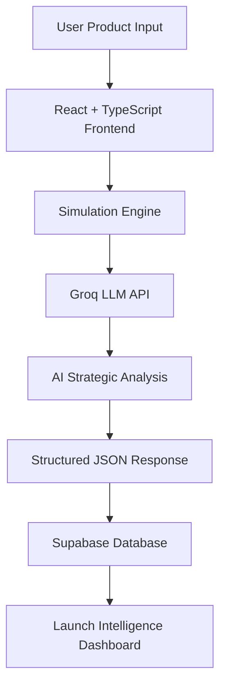

# LaunchIQ.ai

## AI-Powered Product Launch Intelligence Platform

> Simulate market success before launching products using AI-powered strategic consulting intelligence.

---

# Product Overview

| Category | Details |
|----------|----------|
| **Product Name** | LaunchIQ.ai |
| **Category** | AI Product Launch Intelligence Platform |
| **Domain** | Product Strategy • Business Intelligence • AI |
| **Project Type** | Full Stack AI SaaS Application |
| **Status** | MVP Completed |

---

# Problem Statement

Businesses often launch products with limited understanding of:

- Customer purchase intent
- Market sentiment
- Pricing effectiveness
- Competitive positioning
- Launch risk
- Go-To-Market readiness

This uncertainty leads to:

❌ Failed launches  
❌ Poor pricing decisions  
❌ Weak product-market fit  
❌ Ineffective positioning strategies

---

# Solution

LaunchIQ.ai is an **AI-powered Product Launch Intelligence Platform** that simulates the market potential of products before launch.

The platform generates:

- Purchase likelihood prediction  
- Launch risk analysis  
- Market sentiment intelligence  
- Executive strategic summaries  
- Competitive positioning recommendations  
- Pricing strategy insights  
- Go-To-Market recommendations  
- AI-powered consulting outputs

using **Large Language Models (LLMs)** and structured business intelligence workflows.

---

# Target Users

### Primary Users

- Product Managers
- Business Analysts
- Founders & Entrepreneurs
- D2C Brands
- Product Strategy Teams
- Innovation Teams
- Consulting Professionals

### Secondary Users

- Startups
- Growth Teams
- Market Research Teams
- AI Product Teams

---

# MVP Objective

Enable users to evaluate the success potential of products **before launch** through AI-powered launch intelligence simulations.

---

# User Inputs

Users provide:

| Input | Description |
|--------|-------------|
| Product Name | Name of product |
| Category | Product category |
| Industry | Business domain |
| Target Audience | Intended customer segment |
| Price | Product pricing |
| Market Region | Launch geography |
| Product Features | Key differentiators |
| Competitors | Existing competitors |
| Launch Goal | Strategic launch objective |

---

# AI Outputs

LaunchIQ.ai generates:

### Intelligence Metrics
- Purchase Likelihood
- Launch Risk Score
- Market Sentiment
- Confidence Score

### Strategic Intelligence
- Executive Summary
- Strategic Insights
- Market Risks
- Pricing Strategy
- Competitive Positioning
- Go-To-Market Strategy
- AI Recommended Actions

---

# System Architecture



# Tech Stack

## Frontend

```txt
React
TypeScript
Vite
Tailwind CSS
shadcn/ui
React Router
```

## Backend

```txt
Supabase
PostgreSQL
Authentication
Database Persistence
```

## AI Intelligence

```txt
Groq API
Llama 3.3 70B Versatile
Prompt Engineering
Structured JSON Parsing
Strategic Consulting Intelligence
```

## Hosting

```txt
GitHub
```

---

# Supported Industry Simulations

LaunchIQ.ai supports product intelligence simulations across:

```txt
Healthcare
Beauty & Personal Care
Luxury Products
Consumer Electronics
Automotive / EV
FinTech
SaaS
D2C Products
Smart Devices
AI Products
```

---

# Key Features

### AI Consulting Intelligence
Generate McKinsey/Bain-style launch recommendations.

### Strategic Market Analysis
Analyze competitive pressure and launch feasibility.

### Pricing Intelligence
Evaluate premium vs value-based pricing.

### Market Risk Detection
Identify major launch threats.

### Persistent Simulations
Store simulations using Supabase.

### Real-time Results Dashboard
Modern premium UI for launch insights.

---

# Project Demonstration

Complete working project demonstration:

**(Add Google Drive Demo Link Here)**

Includes:

- Frontend walkthrough  
- AI simulations  
- Groq integration  
- Supabase schema  
- Database tables  
- Real-time launch intelligence generation

---

# Project Goal

Build a **recruiter-impressive AI product portfolio project** demonstrating:

- Product thinking  
- Business intelligence capability  
- AI integration expertise  
- Full-stack engineering  
- Strategic consulting mindset  
- End-to-end execution

---

# Current Status

```txt
Frontend Development       Complete
Groq AI Integration        Complete
Supabase Integration       Complete
Launch Intelligence UI     Complete
Simulation Engine          Complete
Testing                    Complete
Deployment                 In Progress
```
