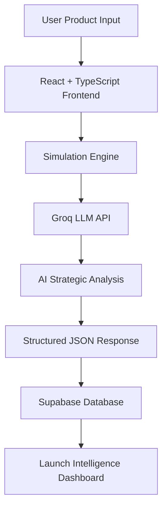

# LaunchIQ.ai

<div align="center">

### AI-Powered Product Launch Intelligence Platform

Simulate market success **before launch** using AI-powered strategic consulting intelligence.


</div>

---

## Overview

LaunchIQ.ai is an **AI-powered Product Launch Intelligence Platform** designed to help businesses evaluate product success potential before launch.

Instead of relying on assumptions, LaunchIQ generates:

- Purchase likelihood prediction  
- Launch risk assessment  
- Market sentiment intelligence  
- Executive strategic summaries  
- Competitive positioning insights  
- Pricing strategy recommendations  
- Go-To-Market strategies  

using **Groq-powered LLM intelligence**.

---

## Live Project Demonstration

### Watch Full Working Demo

**[View Complete Project Demo](https://drive.google.com/file/d/1A4BU1k1jUerxQG_UiIU44Ff6RlT81tnt/view?usp=sharing)**

Demo includes:

- Full frontend walkthrough
- AI-powered simulations
- Groq integration
- Supabase database
- Schema design
- Simulation storage
- Real-time strategic outputs

---

## Key Features

| Feature | Description |
|----------|-------------|
| Purchase Likelihood | Predict customer adoption probability |
| Launch Risk | Estimate launch risk level |
| Market Sentiment | Predict customer reaction |
| Executive Summary | AI-generated consulting insights |
| Strategic Intelligence | Market insights & recommendations |
| Pricing Strategy | AI pricing recommendations |
| Competitive Positioning | Position against competitors |
| GTM Strategy | Go-To-Market recommendations |

---

## System Architecture



---

## Tech Stack

### Frontend

```txt
React
TypeScript
Vite
Tailwind CSS
shadcn/ui
React Router
```

### Backend

```txt
Supabase
PostgreSQL
Authentication
Database Persistence
```

### AI Intelligence

```txt
Groq API
Llama 3.3 70B Versatile
Prompt Engineering
JSON Parsing
Strategic Consulting Intelligence
```

### Deployment

```txt
GitHub
```

---

## Project Screenshots

### Landing Site Interface


### How It Works


### Launch Intelligence Dashboard


### Creating a Simulation


### Launch Simulation Results


### Product Simulation Chart Analysis


### LaunchIQ SupaBase Database Interface


---

## Supported Industry Simulations

```txt
Healthcare
Beauty & Personal Care
Luxury Products
Consumer Electronics
Automotive / EV
FinTech
SaaS
D2C Products
AI Products
```

---

## Repository Structure

```txt
launchiq-ai/
│── architecture/
│── assets/
│── backend/
│── docs/
│── frontend/
│── LaunchIQ_AI_Product_Foundation.md
│── README.md
```
---

## Project Goal

Build a recruiter-impressive AI portfolio project demonstrating:

- Product Thinking
- Business Intelligence
- AI Integration
- Full Stack Development
- Strategic Consulting Intelligence
- End-to-End Product Execution

---

## Author

**Ayush Kumar Sahoo**

Chemical Engineering @ NIT Rourkela'26  
Product Analyst & Strategy • Business Analyst • AI

GitHub:
https://github.com/AYUSHKUMARSAHOO04

---

## Current Status

```txt
Frontend Development       Complete
Groq AI Integration        Complete
Supabase Integration       Complete
Simulation Engine          Complete
Testing                    Complete
Deployment                 In Progress
```
